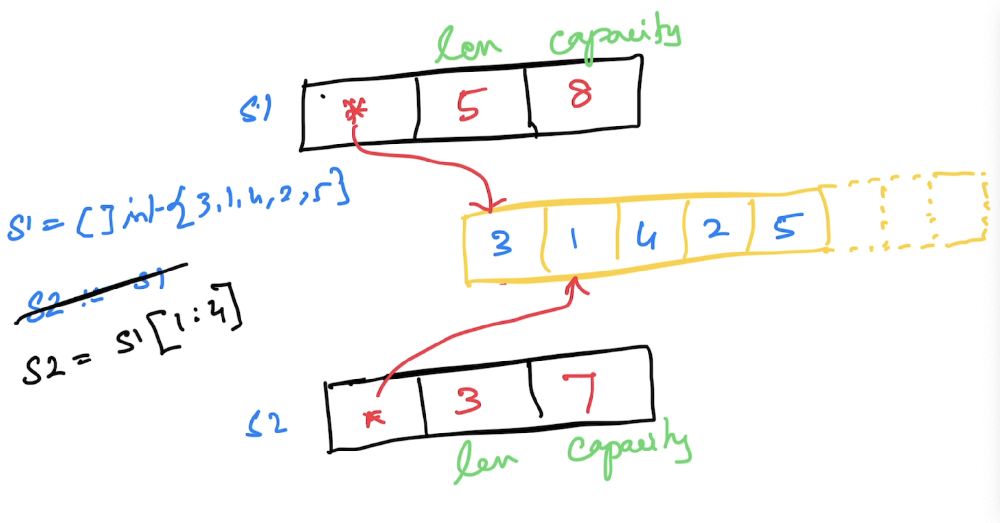

# Go Foundation

## Magesh Kuppan
- tkmagesh77@gmail.com

## Schedule
- Commence      : 09:00 AM
- Tea Break     : 10:30 AM (20 mins)
- Lunch Break   : 12:30 PM (1 hour)
- Tea Break     : 03:00 PM (20 mins)
- Wind up       : 05:00 PM

## Methodology
- No powerpoint
- Code & Discuss

## Software Requirements
- Go Tools (https://go.dev/dl)
- Visual Studio Code OR any editor
    - Go extension (https://marketplace.visualstudio.com/items?itemName=golang.Go)

### Verification
```shell
go version
```

## Repository
- https://github.com/tkmagesh/cisco-gofoundation-mar-2025

## Why Go?
- Simplicity
    - Only one way doing things
        - var, :=
        - if else, switch case
        - for
        - function
        - type
        - package
    - ONLY 25 keywords
    - No access modifiers
    - No reference types (everything is a value)
    - No pointer arithmatic
    - No classes (Only structs)
    - No inheritance (Only composition)
    - No exceptions (Only errors & errors are just values)
    - No try..catch..finally
    - No implicit type conversion
- Performance
    - Comparable with C++
    - Close to hardware
        - Build for specific platform
        - Compiler has native support for cross compilation
- Managed Concurrency
    - Builtin Scheduler to manage concurrent operations
    - "Goroutine" for concurrent operations
        - Cheap (~2KB) vs OS Thread (~4MB)
    - Concurrency support is built in the language
        - "go" keyword
        - "chan" datatype
        - "<-" operator
        - "range" construct
        - "select-case" construct
    - Standard library support
        - "sync" package
        - "sync/atomic" package

## Compilation
```shell
go build [filename.go]
```

## Compile & Execute
```shell
go run [filename.go]
```

## List the go environment variables
```shell
go env
```

## List any specific environment variables
```shell
go env [var_1] [var_2] ....
```

## Change the env variables
```shell
go env -w [var_1]=[value_1] [var_2]=[value_2] ....
```
## Cross compilation
### Env variables for cross-compilation
- GOOS
- GOARCH

### Get the list of supported platforms for cross compilation
```shell
go tool dist list
```

### How to cross compile?
```shell
go env -w GOOS=[target_os] GOARCH=[target_arch]
go build [filename.go]
```
OR
```shell
GOOS=[target_os] GOARCH=[target_arch] go build [filename.go]
```

## Data Types
- string
- bool
- integers
    - int8
    - int16
    - int32
    - int64
    - int
- unsigned integers
    - uint8
    - uint16
    - uint32
    - uint64
    - uint
- floating points
    - float32
    - float64
- complex
    - complex64 ( real[float32] + imaginary[float32] )
    - complex128 ( real[float64] + imaginary[float64] )
- alias
    - byte (alias for unsigned int)
    - rune (alias for unicode code point)

### Zero values
| Data Type | Zero value |
------------ | ------------- |
|int family     | 0 |
|uint family    | 0 |
|float family    | 0 |
|complex family | (0+0i) |
|string         | "" (empty string) |
|bool           | false |
|byte           | 0 |
|interface      | nil |
|pointer        | nil |
|function       | nil |
|struct         | struct instance |

## Variable Declarations
- Using "var" keyword
    - Can be used in both function & package scope
- Using ":="
    - Can be used ONLY in function scope

## Scope
- Package scope
    - Can have "unused" variables
- Function scope
    - Cannot have "unused" variables

## Constant
- Can have unused constants even in "function" scope

## Functions
- Functions can return more than one result
- Variadic functions
- Anonymous functions
- Higher order functions
    - Assign a function as a value to a variable
    - Pass functions as arguments
    - Return functions as return values
- Deferred functions

## Collection Types
### Array
- Fixed sized typed collection
### Slice
- Dynamic sized typed collection
- Use "append()" to add a new item
- Use "len()" to get the size

### Map
- Dynamic sized Typed Collection of Key/Value pairs

## Error handling
- errors are just values in Go
- errors are not "thrown" but "returned" from a function
- By convention, an error is a value implementing "error" interface
- Ways of creating an error
    - Using the following factory functions
        - errors.New()
        - fmt.Errorf()
    - Custom type implementing "error" interface

## Panic & Recovery
### Panic
- The state of the application where the application execution cannot proceed further
- Use "panic()" to programmatically raise a panic
- A panic is typically raised with an error
### Recover
- "recover()" gives access to error that resulted in the panic

## Modularity
### Module
- Any code that has to be versioned and deployed together
- A folder with go.mod file
#### go.mod
- manifest file of the module
    - name of the module
        - should include the complete repo path (advisable)
    - go version targetted
    - list of dependencies
##### Create a module
```shell
go mod init [repo_path/module_name]
```

##### To run a module
```shell
go run .
```

##### To build a module
```shell
go build .
# OR
go build -o [binary_name] .
```

### Package
- internal organization of a module
- a folder with a collection of .go files
- can also be nested
- the package is imported with the complete module reference
- All public entity names must start with uppercase 

### 3rd party modules/packages
#### To download and add reference 
```shell
go get [repo_path/module_name]
```
[ Code is downloaded to '$GOPATH/pkg' folder]

##### To upgrade the dependencies to the latest version
```shell
go get -u [repo_path/module_name]
```

##### To update the go.mod file 
```shell
go mod tidy
```
##### To download the modules referenced in the go.mod file
```shell
go mod download
```
##### To localize the dependencies
```shell
go mod vendor
``` 

##### To list all the dependencies
```shell
go mod graph
```

##### To list all modules in use
```shell
go list -m all
```

##### To list all packages in use
```shell
go list all
```

##### Module command reference
- https://go.dev/ref/mod


## Concurrency

### WaitGroup
- sync.WaitGroup
- Semaphore based counter
- Has the ability to block the execution of a function until the counter becomes 0